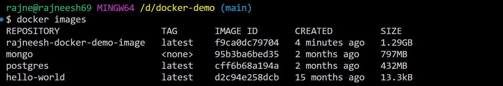

# Docker Demo

This repo demonstrates the creation of DockerFile and how to containerize a simple node.js app.

## RUN vs CMD

### RUN

- To bootstrap the image, the commands we need to run are run by the RUN command.
- Syntax : `RUN npm install`

### CMD

- In order to actually start the containerized application, we use CMD command.
- Syntax : `CMD["node", "dist/index.js"] to run node dist/index.js`
---
### WORKDIR

- Tells the working directory in which the app's dependencies would be installed and it would be run. Syntax : `WORKDIR <directory-name>`

- Do copy the files using `COPY . .` command to actually copy the files/folders from the root directory to the working directory(named `app` in this case).

### EXPOSE

- Exposes the specified port of the docker image which could be later mapped on if the need be, using `docker run -p 1234:3000 <image-name>`

### .dockerignore

- Similar to `.gitignore`, we put the files/folders which we want to be ignored while building an image.

### Building the final image

- Command : `docker build -t <image-name> .`, the dot in the end is the path to tell where the image needs to be built from and could be replaced as per needs.
  Example : `docker build -t rajneesh-docker-demo-image /d/docker-demo` -> give the full path.
- It builds the image with the name and this is the image which would be eventually the docker image would be pushed with.

### Environment varibales in Docker
- Using the ENV command(`ENV ENVIRONMENT_VARIABLE_NAME="VALUE"`) one can hard code it in the Dockerfile, but the downsides are that the unwanted secrets would be exposed.

- Instead, we inject the environment variables when we actually run the image using `docker run -p 27017:27017 -e DATABASE_URL="db_url" username="some_user" <image-name>`
