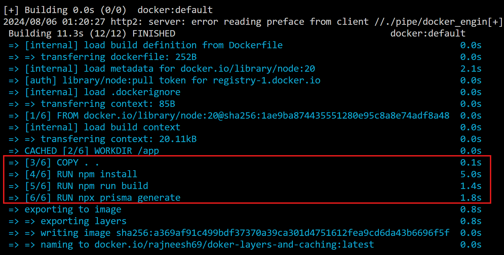

# Docker Demo

This repo demonstrates the creation of DockerFile and how to containerize a simple node.js app.

## Basic Docker commands

- `docker images` : displays all the images on a machine
- `docker ps` : displays all the running containers along with all their info
- `docker run -d -p 27017:27017 -e SOME_ENV_VAR="VALUE" OTHER_ENV_VAR="VALUE2" <image-name>` : runs the image with the specified image name and with the mapped port by using the `-p` flag along with the injected environment variables with the help of `-e` flag ands `-d` to run in detached mode so that the terminal could be reused.
- `docker kill <CONTAINER_ID>` : kills the container with the specified ID
- `docker rmi <image-name> --force` : deletes the image from the machine forcibly

### RUN vs CMD

#### RUN

- To bootstrap the image,i.e., while building the image the commands we need to run.
- Syntax : `RUN npm install`

#### CMD

- In order to actually start the containerized application, we use CMD command.
- Syntax : `CMD["node", "dist/index.js"] to run node dist/index.js`

---

### WORKDIR

- Tells the working directory in which the app's dependencies would be installed and it would be run. Syntax : `WORKDIR <directory-name>`

- Do copy the files using `COPY . .` command to actually copy the files/folders from the root directory to the working directory(named `app` in this case).

### EXPOSE

- Exposes the specified port of the docker image which could be later mapped on if the need be, using `docker run -p 1234:3000 <image-name>`

### .dockerignore

- Similar to `.gitignore`, we put the files/folders which we want to be ignored while building an image.

### Building the final image

- If you want to push the image on docker hub, make sure the name of the image and the repository name on docker hub is same.
- Command : `docker build -t <image-name> .`, the dot in the end is the path to tell where the image needs to be built from and could be replaced as per needs.
  Example : `docker build -t rajneesh-docker-demo-image /d/docker-demo` -> give the full path.
- It builds the image with the name and this is the image which would be eventually the docker image would be pushed with.

### Environment variables in Docker

- Using the ENV command(`ENV ENVIRONMENT_VARIABLE_NAME="VALUE"`) one can hard code it in the Dockerfile, but the downsides are that the unwanted secrets would be exposed.

- Instead, we inject the environment variables when we actually run the image using `docker run -p 27017:27017 -e DATABASE_URL="db_url" username="some_user" <image-name>`

### Docker in interactive mode

- To get full access of the container run the following command:
  `docker exec -it <container-name-or-id> /path/to/directory`
  Example:
  `docker exec -it <container-name-or-id> /bin/bash`

### Pushing to dockerhub

- Signin/ Signup on docker hub.
- Create a repo and then use the following command : `docker push <image-name>:<tagname>`
- Example: `docker push rajneesh69/docker-demo-image:latest`

## Layers in Docker
- Every FROM, WORKDIR, COPY, RUN etc. command adds a layer to the docker container and this is what helps docker to cache some files already if the build command is run multiple times which eventually saves the time.

- To optimize the docker containers we need to have an understanding of these layers so that we can efficiently manage and optimize docker containers.

- If the base image is same then the layers could be shared across images.

- If a layer is cached then everything before it is cached and if a layer is uncached then after it everything is uncached.

- Made a change in index.ts to uncache the COPY layer which led to the following layers go uncached.

- We want as much as layers to be cached, so that if another docker build is run(even for some other project, as layers could be shared across images), then the time/computation/resources could be saved. 

  
#### (Q) Since, dependencies don't change very often, why not try to cache them?
  
  Ans. One of the ways to do it is by incrementally copying the files instead of all at once.

  So, `instead of COPY . .`, we can do the following:
  
  1. COPY package* .
  2. COPY ./prisma .
  3. RUN npm install
  4. RUN npx prisma migrate
  5. COPY . .

        ... rest of the file

- Try to push the COPY . . command as down as possible so that when the source code changes(which changes/could change very often) only a few layers are affected.
- More layers don't mean more computation.

## Networks and Volumes

1. Need to persist data across docker restarts -> volume.
2. Need to allow containers to talk to each other -> network.

### Volumes
- Command : `docker volume create <volume-name>`
- `docker volume ls`: lists all the volumes
- Create a volume and attach(mount) it to the database instance to regain the data
  - Run this: `docker run -v volume_database:/data/db -p 27017:27017 mongo`
- So we don't need to store the entire filesystem but the folders which contain the actual data like `/data/db`(location could be different for different images) in case of the mongo image. To access it run : `docker exec -it <container-id> /bin/bash`

- Now if the container is restarted with the attached volume then the data would be persisted
  - `docker run -v volume_database:/data/db -p 27017:27017 mongo`

 
### Networks
- To make containers talk to each other we use the concept of Networks.
- The main problem which it solves is that suppose if you run a node.js app inside one container and a mongo app in another, then the containers won't be able to talk, because they have their own networking system and ports.

- To create a network run : `docker network create <network-name>` &rarr; `docker network create my_custom_network`
  - It will be created with the `bridge` driver.

- Now if we start mongodb in a container along with a volume(volume isn't necessary) with a specific name(it's important)
  - `docker run -d -v volume_database:/data/db --name mongodbContainer --network my_custom_network -p 27017:27017 mongo` 

- Now, rebuild the nodejs image, start the node container but with the different mongodb url, with the name of the container we gave to the mongodb container: `mongodb://mongodbContainer:27017/myDB` &rarr; important!
  - `docker run -d -p 3000:3000 --name nodejsApp --network my_custom_network node-js-image`
- This command will make the node app container talk to the mongo container.